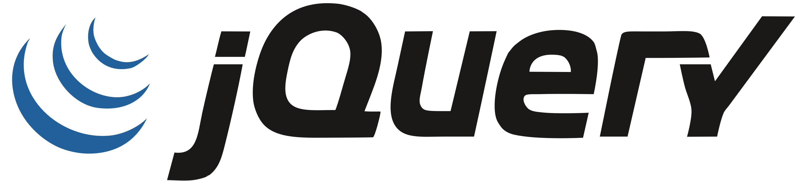
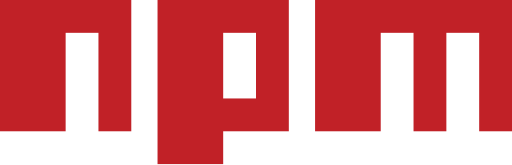

# Hi there 👋

My name is Zeyad Gamal, I'm a junior front-end developer actively seeking job opportunities. Feel free to reach out to me via email: zeyadsoliman96@gmail.com.

## Goals and Interests
- Passionate about front-end development and user interface design.
- Interested in learning new technologies and keeping up to date with trends in the industry.

## Languages & Tools:

           

<!--
**ZeyadGamal96/ZeyadGamal96** is a ✨ _special_ ✨ repository because its `README.md` (this file) appears on your GitHub profile.

Here are some ideas to get you started:

- 🔭 I’m currently working on ...
- 🌱 I’m currently learning ...
- 👯 I’m looking to collaborate on ...
- 🤔 I’m looking for help with ...
- 💬 Ask me about ...
- 📫 How to reach me: ...
- 😄 Pronouns: ...
- ⚡ Fun fact: ...
-->
